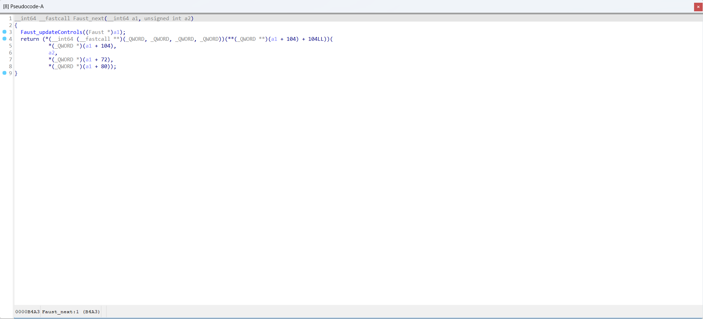
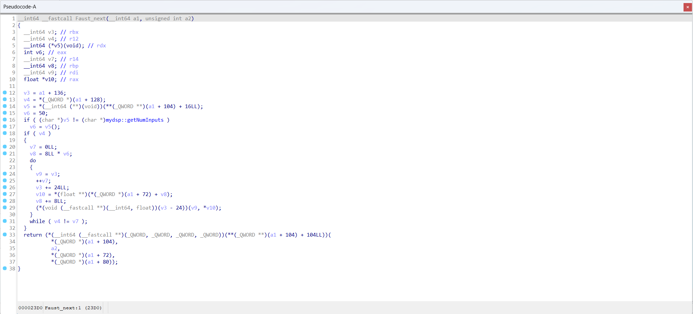
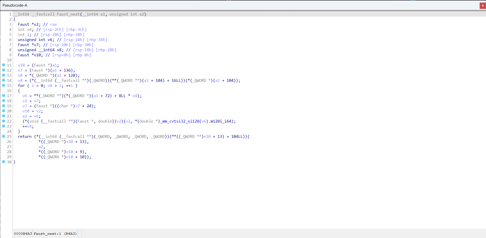

<h1 align="center">OpTrans: Enhancing Binary Code Similarity Detection with Function Inlining Re-Optimization</h1>

<h4 align="center">
<p>
<a href=#about>About</a> |
<a href=#news>News</a> |
<a href=#intuition>Intuition</a> |
<a href=#quickstart>QuickStart</a> |
<a href=#details>Details</a> |
<p>
</h4>

## About

OpTrans (Re-Optimization Transformer), is an innovative framework fuses binary code optimization techniques with the transformer model for BCSD. By OpTrans employs an algorithm based on binary program analysis to determine which functions should be inlined, followed by binary rewriting techniques to effectuate re-optimization on binaries. Our goal is to provide an effective tool for researchers and practitioners in binary code similarity detection, with our models accessible on the Hugging Face Model Hub.

## News

- [2024/3/27] OpTrans is available on Hugging Face Model Hub (https://huggingface.co/sandspeare/optrans).


## Intuition

This document will present how function inlining optimization improve binary code similarity detection.

Function Faust_next in sc3-plugins-HOAEncLebedev501.so compiled with -O0 (sc3-plugins-HOAEncLebedev501.so-O0.i64)


Function Faust_next in sc3-plugins-HOAEncLebedev501.so compiled with -O3 (sc3-plugins-HOAEncLebedev501.so-O3.i64)


Function Faust_next in sc3-plugins-HOAEncLebedev501.so compiled with -O0 and processed by function inlining optimization (sc3-plugins-HOAEncLebedev501.so-O0-inline.i64)


The idb files in ./Intuition are generated by IDA-8.3

## QuickStart

This document will help you set up and start using the OpTrans model for embedding generation.


### Requirements
- Python 3.6 or higher
- [PyTorch](https://pytorch.org/get-started/locally/)
- [Transformers library](https://huggingface.co/docs/transformers/installation)
- A CUDA-enabled GPU is highly recommended for faster processing.

Ensure you have Python and PyTorch installed on your system. Then, install the Transformers library using pip:
```bash
pip install transformers
```

### Preparing Tokenizers and Models
Import necessary libraries and initialize the model and tokenizers:
```python
import torch
from transformers import AutoModel, AutoTokenizer

device = torch.device("cuda" if torch.cuda.is_available() else "cpu")

tokenizer = AutoTokenizer.from_pretrained("sandspeare/optrans", trust_remote_code=True)
encoder = AutoModel.from_pretrained("sandspeare/optrans", trust_remote_code=True).to(device)
tokenizer.pad_token = tokenizer.unk_token
```

### Example Use Cases
**Function inlining optimization for BCSD**

1. Load your binary code dataset. For demonstration, we use a pickle file containing binary code snippets for similarity compare.

```python
with open("./CaseStudy/casestudy.json") as fp:
   data = json.load(fp)
```

2. Encode the binary code.

```python
asm_O0 = tokenizer([data["O0"]], padding=True, return_tensors="pt").to(device)
asm_embedding_O0 = encoder(**asm_O0)

asm_O0_inline = tokenizer([data["O0_inline"]], padding=True, return_tensors="pt").to(device)
asm_embedding_O0_inline = encoder(**asm_O0_inline)

asm_O3 = tokenizer([data["O3"]], padding=True, return_tensors="pt").to(device)
asm_embedding_O3 = encoder(**asm_O3)
```

3. Perform similarity comparison:

```python
sim_O0vsO3 = torch.mm(asm_embedding_O0, asm_embedding_O3.T).squeeze() / 0.07
sim_O0_inlinevsO3 = torch.mm(asm_embedding_O0_inline, asm_embedding_O3.T).squeeze() / 0.07
```

## Details
In this document, we provide an overview of the contents of this repository and instructions for accessing the materials.

1. **CaseStudy.ipynb**: A Jupyter Notebook showcasing the zero-shot performance of our proposed model using a case study. Please open this file to get an in-depth view of how our model works and the results it produces.

2. **CaseStudy**: A folder containing binary code for the case study used in the Jupyter Notebook.

3. **Intuition**: A folder containing screenshots of how inling optimization eliminate false positive in binaries. Corresponding functions also presented in IDB file.


### Processing Data
We provide a example script to process the binary code. The script is located at `scripts/process.py`. You can use the script to process your own binaries.
```bash
/path/to/idat64 -c -A -S"scripts/process.py /path/to/output /path/to/inlinefuncs"  /path/to/binary
```
Here is a demo
```bash
/path/to/idat64 -c -A -S"scripts/process.py Intuition/sc3-plugins-HOAEncLebedev501.json Intuition/O0_inline.pkl" Intuition/sc3-plugins-HOAEncLebedev501.so-O0.i64
```

### Fine-tune
We provide a script to fine-tune the base model with your own datasets.
```bash
python fine_tune.py
```

### Fast evalution
We provide scripts to fast evaluate the model performance of binary code similarity detection.

```bash
python create_embeddings.py --output_path embedding_dataset
python fast_eval.py --data_path embedding_dataset
```